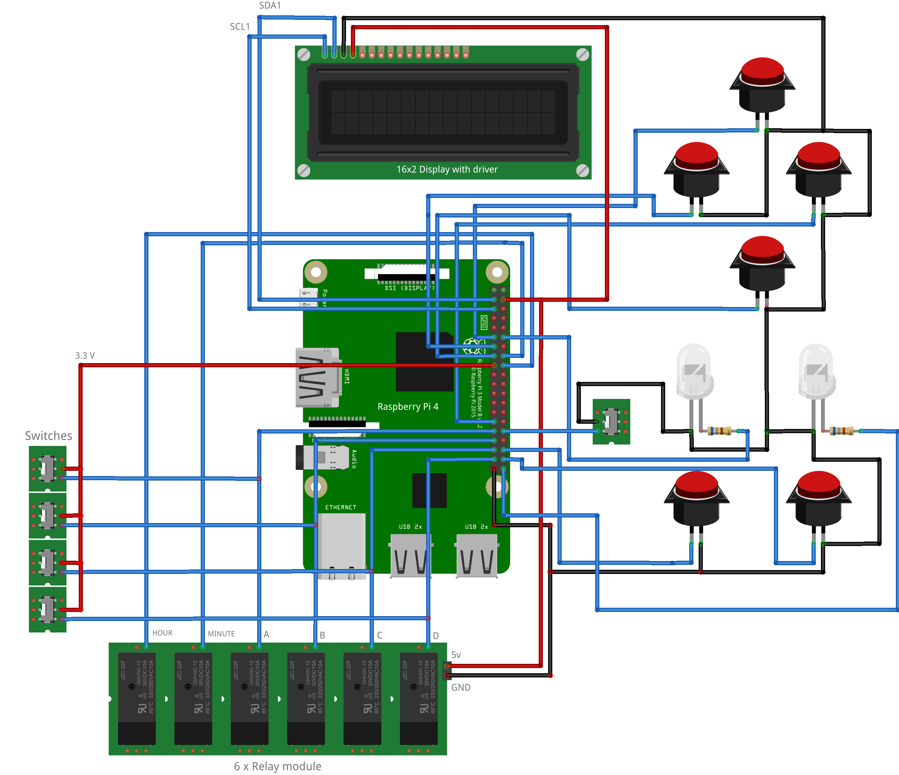
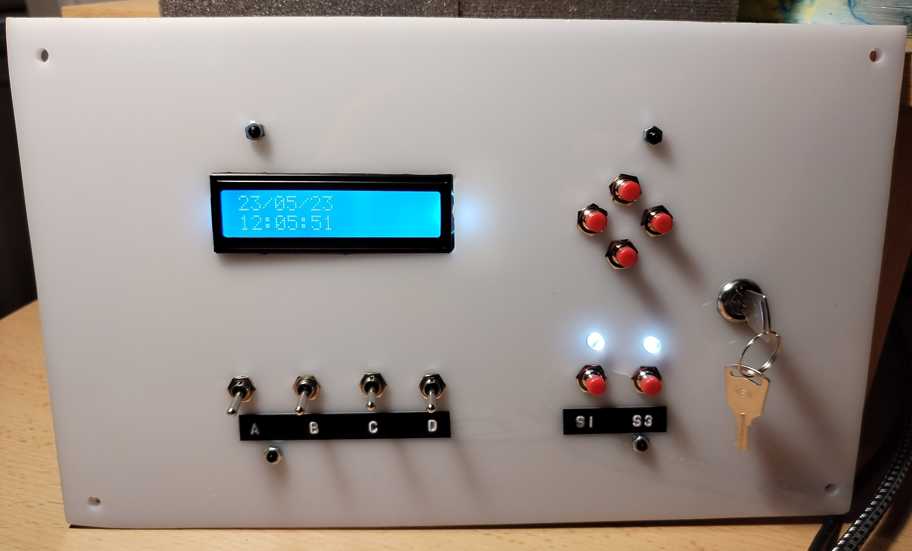

# Belfry controller 🏫

This package controlls four bells and belfry watch. Bells and watch handles are moved by electric motors and they are controlled by relays. 

It runs on Raspberry Pi 4 Model B. 🚀

## Features:
- Automatic belfry watch setup
- Manual belfry watch setup
- Automatic ringing presets
- Manual ringing
- Two function buttons which can activate two ringing presets
- Display which shows current date and time

## Wiring diagram:


## Setup:

Before running this package check and (if it is necessary) change
`watch_time.txt`, `handles_movement_log.txt` and `function_buttons.txt` files, they are logs that help to preserve the
data necessary for working and keeping the correct time on the belfry watch. 

In `watch_time.txt` set current time on belfry watch. Like this: 
```
17:24:00
```

`handles_movement_log.txt` tracks which watch handle last moved, you can set this like this:
```
hour_handle
```

then change `function_buttons.txt` file as it is showed below:
```
True 23/05/23 15:25:11 
True 23/05/23 15:25:10 
```
or leave it as it is. This file tracks which (ringing) function is activated and when.

Also you can make service and you can enable it to execute the `main.py` file after the Raspberry Pi connects to the network after startup.

I made `belfry.service` as service which executes `belfry.sh` which then executes the `main.py`. 
You can locate these two files as it is specified inside each file and start the `belfry.service` with the next command:

```
sudo systemctl start belfry.service
```

also you can enable starting this service on startup with:

```
sudo systemctl enable belfry.service
```

[Here](https://www.freedesktop.org/wiki/Software/systemd/NetworkTarget/) you can see more about automatically starting some scripts after connecting to the network at the startup.

## Overview:

